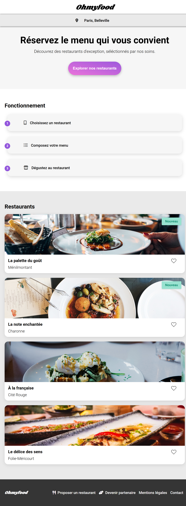
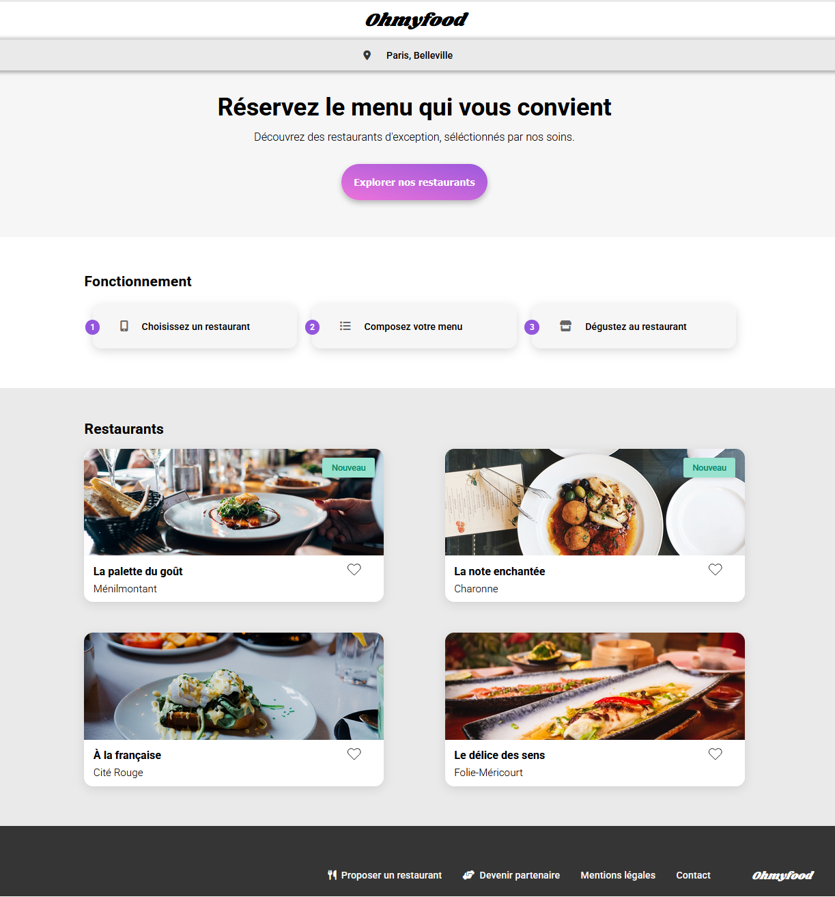
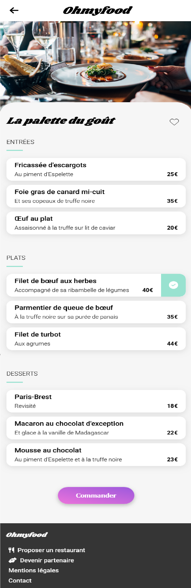

🌟 Projet 03 - Ohmyfood

📖 Présentation

Ohmyfood est un projet de site web permettant aux utilisateurs de consulter les menus de restaurants gastronomiques et de composer leur repas à l’avance.

Ce projet est réalisé en tant que développeur web au sein de la start-up Ohmyfood.

L'objectif principal est d'intégrer l'interface du site à l’aide de HTML et CSS, en suivant les maquettes fournies par l’UI designer. 
L’interface devra être responsive, respecter les standards d’accessibilité, et intégrer des animations soignées.

---

📸 Aperçu du projet

### Page d’accueil Mobile


### Page d’accueil Desktop 


### Exemple de menu Mobile



---

🗂️ Structure du Projet

Projet-03-Ohmyfood/  
├── index.html 
├── restaurants/
│   ├── a-la-francaise.html
│   ├── la-note-enchantee.html
│   ├── la-palette-du-gout.html
│   ├── le-delice-des-sens
├── css/  
│   ├── style.css
│   ├── restaurant.css
├── images/ 
└── README.md

---

🚀 Fonctionnalités

- Affichage des menus de 4 restaurants
- Animation d’ouverture des menus
- Sélection de plats avec animation (icône coche)
- Design responsive (mobile first)
- Transitions et animations CSS fluides
- Navigation claire et structurée

---

🔧 Technologies Utilisées

- HTML5
- CSS3
- Flexbox & Grid
- Animations CSS (`@keyframes`, `transition`)
- Responsive Design (mobile, tablette, desktop)

---

📝 Validation

Pour garantir la qualité du code, nous utilisons les validateurs W3C :

- ✅ Validateur HTML  
- ✅ Validateur CSS

---

⚙️ Installation

Cloner le dépôt GitHub :

```bash
git clone https://github.com/MTDev2024/Projet-03-Ohmyfood.git
